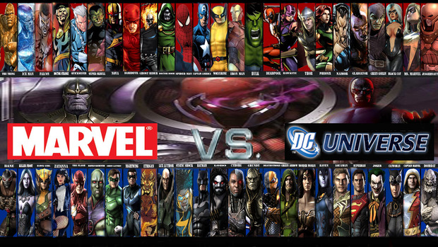

<div style="position: relative; text-align: center; color: white;">
  <h1 align="center" style="position: relative; z-index: 1;">SIMULADOR DE BATALLAS</h1>
  
  <div style="position: absolute; top: 0; left: 0; width: 100%; padding-top: 50px;">

  <h2>Bienvenido a <strong>SUPERHERO BATTLE ARENA: THE ULTIMATE SHOWDOWN</strong></h2>
  <p>Esta innovadora aplicación te permite sumergirte en el fascinante mundo de los superhéroes, combinando el poder del análisis de datos y el machine learning. Con esta herramienta, podrás explorar detalladamente las características de tus héroes favoritos de Marvel y DC, simular enfrentamientos épicos y descubrir quién sería el vencedor en el combate definitivo. Nuestra aplicación utiliza técnicas avanzadas de Machine Learning y un exhaustivo Análisis Exploratorio de Datos (EDA) para brindarte una experiencia única y emocionante. Prepárate para experimentar la ciencia detrás de cada batalla y disfruta de la adrenalina de cada enfrentamiento en la Superhero Battle Arena.</p>
</div>

## Resumen de datos 

La aplicacion utiliza un conjunto de datos detallados que incluye caracteristica clave de los superheroes. A continuacion, se presenta un pequeño resumen de los datos disponibles:

- **Nombre**: Nombre del superheroe. 
- **Strength**: Valor que representa la fuerza del superheroe. 
- **Speed**: Valor que representa la velocidad del superhéroe.
- **Durability**: Valor que representa la armadura del superhéroe.
- **Power**: Valor que representa el poder general del superhéroe.
- **Combat**: Valor que representa las habilidades de combate del superhéroe.

A continuacion, se presenta una muestra de los datos:

### Datos de Muestra

| Name              |   Strength |   Speed |   Durability |   Power |   Combat |
|:------------------|-----------:|--------:|-------------:|--------:|---------:|
| Captain America   |         19 |      17 |           16 |      16 |       17 |
| Thor              |         78 |      83 |           60 |      84 |       56 |
| Iron Man          |         88 |      63 |           80 |      90 |       64 |
| Black Widow       |         13 |      27 |           10 |      17 |       16 |
| Spider-Man        |         55 |      57 |           55 |      60 |       55 |


## Instalación

Para instalar y ejecutar esta aplicación en tu máquina local utilizando Visual Studio Code (VSCode), sigue estos pasos:

1. **Clona este repositorio**:
    - Abre VSCode.
    - Abre la terminal integrada con ``Ctrl+` `` (Control + tecla de acento grave) o desde el menú: `View -> Terminal`.
    - Ejecuta el siguiente comando en la terminal:
    ```bash
    git clone https://github.com/Lokhy87/Proyecto-Machine-Learning.git
    ```

2. **Navega al directorio del proyecto**:
    - En la terminal integrada de VSCode, navega al directorio del proyecto con el siguiente comando:
    ```bash
    cd Proyecto-Machine-Learing
    ```

3. **Instala las dependencias necesarias**:
    - Asegúrate de tener `pip` instalado.

## Uso

Para iniciar la aplicación, ejecuta el siguiente comando en la terminal integrada de VSCode:
```bash
streamlit run app.py

